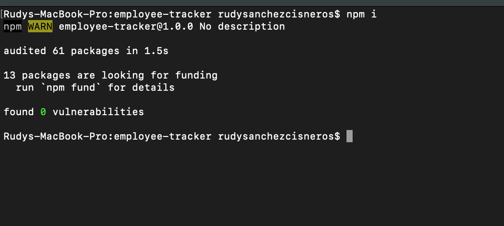
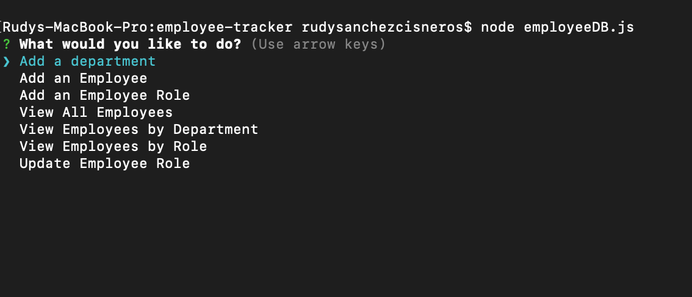
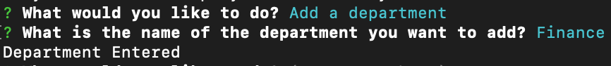
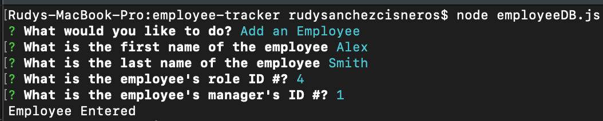
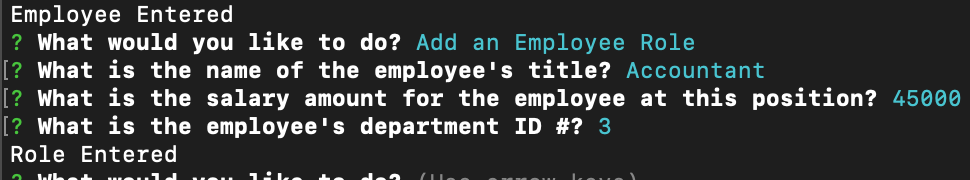
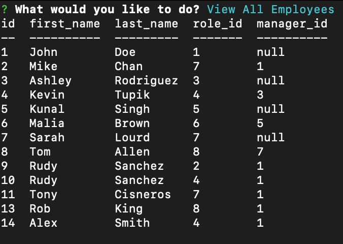
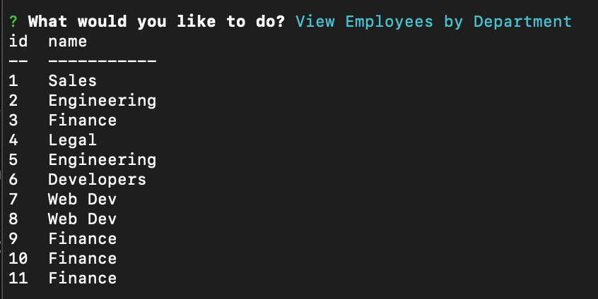
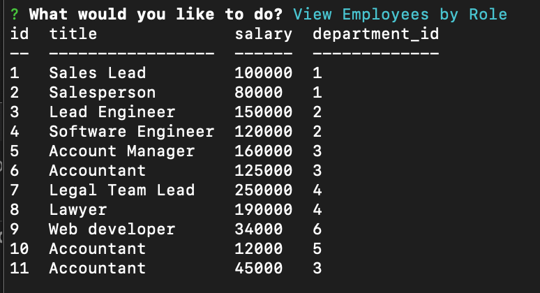
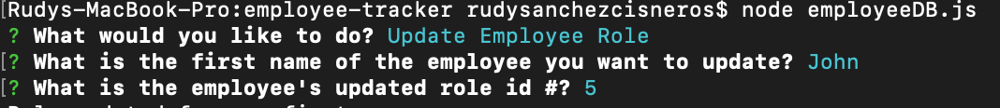

# Employee Tracker

## **Description**  
-------------
This application is a **C**ontent **M**anagement **S**ystems created using Node.JS, Inquirer, and MySQL. Users would be able to keep track of their employees and any information that pertains to their job within a company. The employees entered into the database would all have a department, role and other employee information stored and ready to be reviewed by management. 

 ## **How to Use**
 ---------------
- The user would start by first installing the dependencies with the command:  ```npm i```.

 
  
- The user would start the application by entering the command:  ```node employeeDb.js```. This would start the application by bringing the user to the main menu. From there, the user can Add a department, Add an employee, Add an employee role, View all employees, View employees by department, view employees by role, or update an employee role.
  
  

- The user can select _Add a department_, which would prompt the user to enter the department name.
  
  
 
 - The user can select _Add an employee_, which prompts them to enter the employee's first name, last name, employee role ID number, and the employee manager's ID number.

  

   - The user can select _Add employee role_, which prompts them to enter the employee's job title, salary, and the department ID number where they work.

  

   - The user can select _View all employees_, which show all the employees entered into the database and their employee information.

  

   - The user can select _View employees by Department_, which show all the employees entered into the database based on their department.

  

   - The user can select _View employees by Role_, which shows all the employees entered into the database based on their role.

  

   - The user can select _Update Role_, which prompts the user to enter the name of employee who's role id number they want to update and what their new role id number will be.

  

## **Built With**
---------------
- 
- 
- 

## **Contributors**
--------------------
  [](https://forthebadge.com)

- Rudy S. [GitHub](https://github.com/Rudys212)

## **License**
--------------------
MIT License

Copyright (c) 2021 Rudys212

Permission is hereby granted, free of charge, to any person obtaining a copy
of this software and associated documentation files (the "Software"), to deal
in the Software without restriction, including without limitation the rights
to use, copy, modify, merge, publish, distribute, sublicense, and/or sell
copies of the Software, and to permit persons to whom the Software is
furnished to do so, subject to the following conditions:

The above copyright notice and this permission notice shall be included in all
copies or substantial portions of the Software.

THE SOFTWARE IS PROVIDED "AS IS", WITHOUT WARRANTY OF ANY KIND, EXPRESS OR
IMPLIED, INCLUDING BUT NOT LIMITED TO THE WARRANTIES OF MERCHANTABILITY,
FITNESS FOR A PARTICULAR PURPOSE AND NONINFRINGEMENT. IN NO EVENT SHALL THE
AUTHORS OR COPYRIGHT HOLDERS BE LIABLE FOR ANY CLAIM, DAMAGES OR OTHER
LIABILITY, WHETHER IN AN ACTION OF CONTRACT, TORT OR OTHERWISE, ARISING FROM,
OUT OF OR IN CONNECTION WITH THE SOFTWARE OR THE USE OR OTHER DEALINGS IN THE
SOFTWARE.

## **Links** 
---------------
- [GitHub Repo](https://github.com/Rudys212/employee-tracker)

- [Walk-through Video](https://drive.google.com/file/d/1MFcgRxhVCtWRvnXnRKEuMz1pP2U2_eol/view)